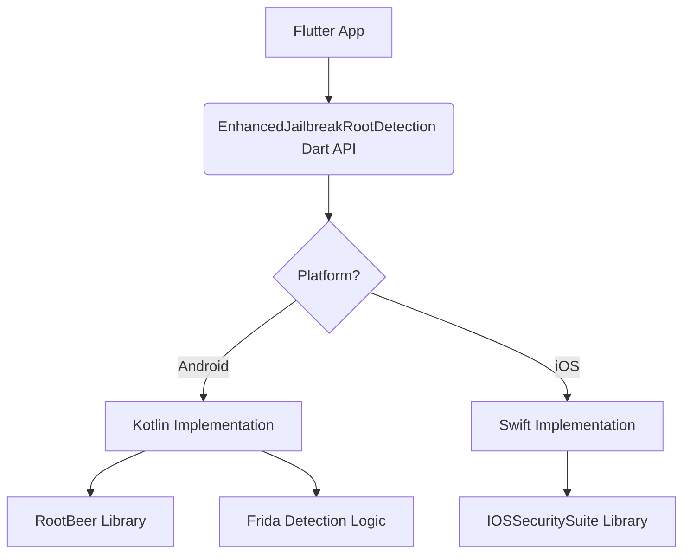

# Project Architecture & Detection Logic 🗺️

This document outlines the high-level architecture of the **Enhanced Jailbreak & Root Detection** plugin and explains the logic behind its multi-layered security checks.

## High-Level Overview

The plugin follows a standard Flutter federated plugin architecture, with a Dart interface layer and platform-specific implementations for Android and iOS.

## Android Detection Layers

Android security is inherently complex due to the variety of root methods. We use a "Defense in Depth" strategy:

### 1. RootBeer (Standard Checks)
We integrate the `RootBeer` library to perform standard checks:
- **SU Binary:** Looking for the `su` binary in common paths.
- **Busybox:** Detecting `busybox` installation.
- **Dangerous Properties:** Checking for suspicious system properties.
- **Potentially Dangerous Apps:** Looking for SuperUser, Magisk Manager, etc.

### 2. Frida Detection (Advanced)
Frida is a common dynamic instrumentation toolkit. Our "Enhanced" logic specifically targets it:
- **Port Scanning:** Checking for the default Frida server port (27042).
- **Process List:** Searching for "frida-server" in the running processes.
- **Module Scanning:** Checking loaded modules for Frida signatures or "frida-gadget".
- **FD Safety:** All native checks are written to prevent File Descriptor leaks using Kotlin's `.use` extension, ensuring that the detection itself doesn't destabilize the app.

### 3. 16KB Page Size Support
Modern Android devices are moving towards 16KB page sizes. Our native C++ components (like `antifrida.cpp`) are compiled to be compatible with this architecture, ensuring the plugin works on next-gen hardware.

## iOS Detection Layers

On iOS, we rely on the industry-leading `IOSSecuritySuite`:

- **Jailbreak Detection:** Checks for Cydia, Sileo, and other jailbreak-specific files and directory permissions.
- **Reverse Engineering Tools:** Detects debuggers, simulators, and common RE toolkits.
- **System Integrity:** Verifies that the system hasn't been compromised (e.g., checking for symlinks where they shouldn't be).

## False Positive Mitigation

A security tool that blocks legitimate users is as bad as one that fails to detect threats. We mitigate false positives by:
- **Simulator Awareness:** Distinguishing between a "rooted/jailbroken" device and a developer's simulator.
- **Real Device Heuristics:** Only certain "dangerous" checks are considered critical for real device environments.
- **Issue Classification:** Allowing developers to check for specific issues via `checkForIssues()` instead of just a binary "trusted/not trusted" result.

## Hardened Implementation

The plugin's native code is regularly audited for:
- **File Descriptor Leaks:** Ensuring all process streams are closed.
- **Thread Safety:** Method channel calls are handled on appropriate threads to prevent UI jank.
- **Null Safety:** Strict null handling across the Dart-Native boundary.
