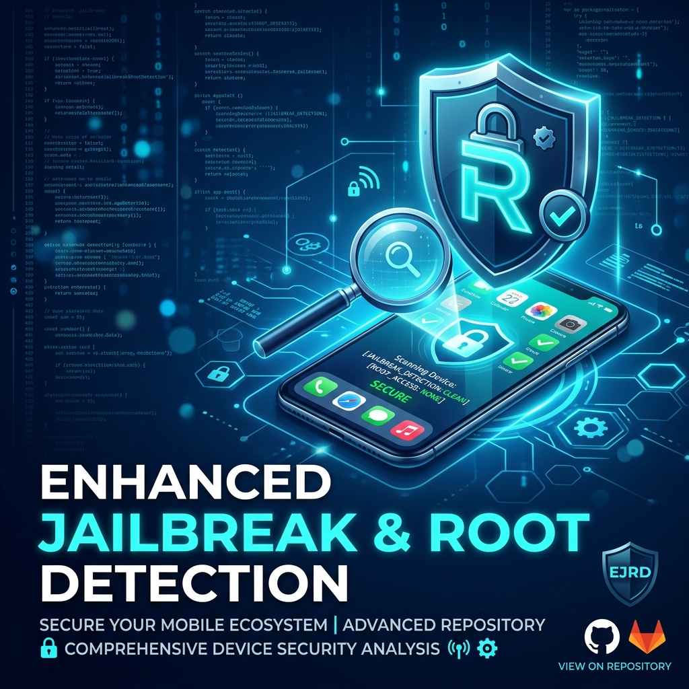

# Enhanced Jailbreak & Root Detection 🛡️



[](https://pub.dartlang.org/packages/enhanced_jailbreak_root_detection)
[](https://github.com/wm-jenildgohel/enhanced_jailbreak_root_detection/actions/workflows/flutter_plugin.yml)
[](https://opensource.org/licenses/MIT)
[](https://pub.dev/packages/enhanced_jailbreak_root_detection)

A super-charged, multi-layered security plugin for Flutter. It combines industry-standard detection methods with advanced heuristic checks to provide a rock-solid defense against rooted and jailbroken environments.

## ✨ Why Choose This Plugin?

Unlike basic detection libraries, **Enhanced Jailbreak & Root Detection** uses a defense-in-depth approach:

- **Android:** 
  - 🛡️ **RootBeer:** Standard root detection (busybox, su binary, etc.).
  - 🔍 **Frida Detection:** Advanced checks for Frida server processes, gadgets, and signatures.
  - 🧩 **16KB Page Size:** Full support for modern Android architectures.
  - 🧹 **No FD Leaks:** Hardened Kotlin implementation with strict resource management.
- **iOS:**
  - 🛡️ **IOSSecuritySuite:** Comprehensive jailbreak and reverse engineering detection.
  - 📱 **Real Device Focus:** Optimized to minimize false positives on emulators while maintaining maximum sensitivity on hardware.

## 🚀 Getting Started

### Installation

Add the dependency to your `pubspec.yaml`:

```bash
flutter pub add enhanced_jailbreak_root_detection
```

Or manually add it:

```yaml
dependencies:
  enhanced_jailbreak_root_detection: ^0.0.2
```

### 📋 Platform Configuration

#### Android
No additional configuration is required for standard use. For 16KB page size support details, see [Android Documentation](android/README.md).

#### iOS
Add the following `LSApplicationQueriesSchemes` to your `ios/Runner/Info.plist` to allow the plugin to detect common jailbreak apps:

```xml
<key>LSApplicationQueriesSchemes</key>
<array>
  <string>undecimus</string>
  <string>sileo</string>
  <string>zbra</string>
  <string>filza</string>
  <string>activator</string>
  <string>cydia</string>
</array>
```

## 📦 Usage

The plugin provides a simple, singleton-based API for quick checks.

```dart
import 'package:enhanced_jailbreak_root_detection/enhanced_jailbreak_root_detection.dart';

void checkSecurity() async {
  final detection = EnhancedJailbreakRootDetection.instance;

  // Check if device is jailbroken (iOS) or rooted (Android)
  final isJailBroken = await detection.isJailBroken;
  
  // Comprehensive "is not trust" check (Android specific Frida + RootBeer)
  final isNotTrust = await detection.isNotTrust; 
  
  // Check if it's a real device (minimal false positives)
  final isRealDevice = await detection.isRealDevice;
  
  // Check for developer mode (Android)
  final isDevMode = await detection.isDevMode;

  if (isNotTrust || isJailBroken) {
    print("⚠️ Security Compromise Detected!");
  }
}
```

## 🛠️ Advanced Usage: Detailed Issues

You can get a detailed list of detected security issues:

```dart
final issues = await detection.checkForIssues();
for (var issue in issues) {
  print("Detected issue: ${issue.name}");
}
```

## 🗺️ Roadmap & Architecture

We aim to keep this plugin as the gold standard for Flutter security.
- [x] Initial Frida detection (Android)
- [x] Support for Android 16KB page size
- [x] Stabilized Kotlin resource management
- [ ] Runtime integrity checks for iOS
- [ ] Obfuscation detection improvements

For a deeper dive into how the detection logic works, see [ARCHITECTURE.md](ARCHITECTURE.md).

## 🤝 Contributing

We love contributions! Whether it's fixing a bug, adding a feature, or improving documentation, please see our [CONTRIBUTING.md](CONTRIBUTING.md).

## 📄 License

This project is licensed under the MIT License - see the [LICENSE](LICENSE) file for details.

---
Built with ❤️ for the Flutter Community.
